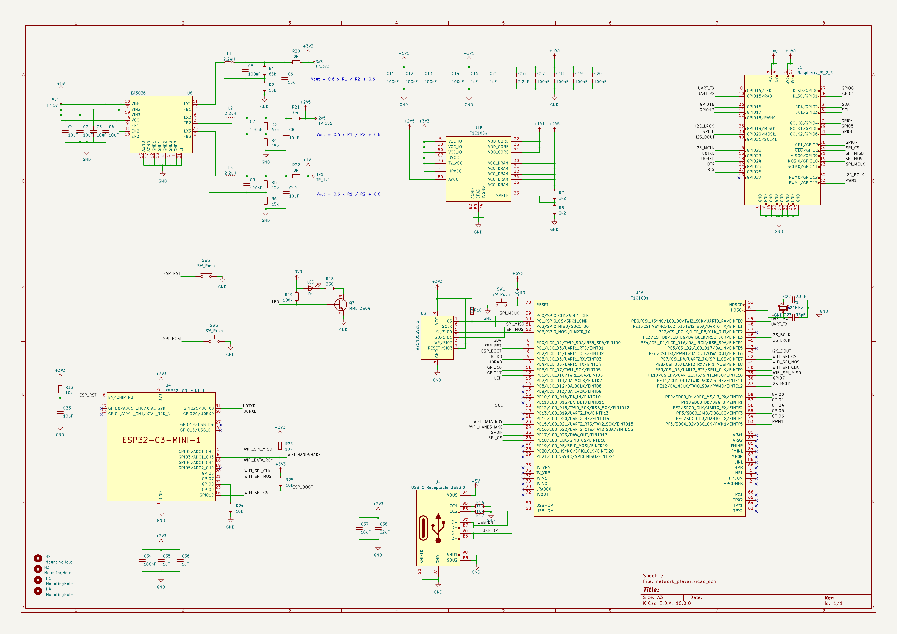

# mds-hardware

KiCad sources and fabrication outputs for a small network audio player board built around an Allwinner F1C200s SoC, an ESP32-C3 for Wi-Fi, NAND flash storage, an EA3036 power management IC, and an audio DAC daughter board.

The repository contains two KiCad projects:
- [network_player/](network_player/) — the main board
- [dac/](dac/) — the audio DAC daughter board

## Versions

| Version | Date       | Status                                         | Schematic | PCB | Gerbers |
|---------|------------|------------------------------------------------|-----------|-----|---------|
| v1      | 2024-01-15 | Sent to JLCPCB, had routing issues             | [PDF](docs/v1/schematic.pdf) | [PDF](docs/v1/pcb.pdf) | [ZIP](docs/v1/gerbers.zip) |
| v1.1    | 2024-06-02 | Sent to JLCPCB, fixes routing issues of v1     | [PDF](docs/v1.1/schematic.pdf) | [PDF](docs/v1.1/pcb.pdf) | [ZIP](docs/v1.1/gerbers.zip) |
| v2      | 2024-06-01 | Full redesign, never produced                  | [PDF](docs/v2/schematic.pdf) | [PDF](docs/v2/pcb.pdf) | [ZIP](docs/v2/gerbers.zip) |

Each version lives on its own branch: [`users/nico/v1`](../../tree/users/nico/v1), [`users/nico/v1.1`](../../tree/users/nico/v1.1), [`users/nico/v2`](../../tree/users/nico/v2). The `v1_jlcpcb` tag points to the JLCPCB return files for v1.

## Latest produced version: v1.1

v1.1 is the version that was actually fabricated and assembled by JLCPCB. Compared to v1, it brings the following changes (see commit [b7ff0fe](../../commit/b7ff0fe)):

- Removed the discrete transistors used for ESP32 boot/reset, driven directly from F1C200s GPIOs instead
- EA3036 enable pin tied to 3.3 V
- Added a RST button that pulls the MISO line to ground to disable booting from flash
- ESP32 moved to SPI1; SPI0 is now shared between the NAND flash and the RPi connector

### Schematic

